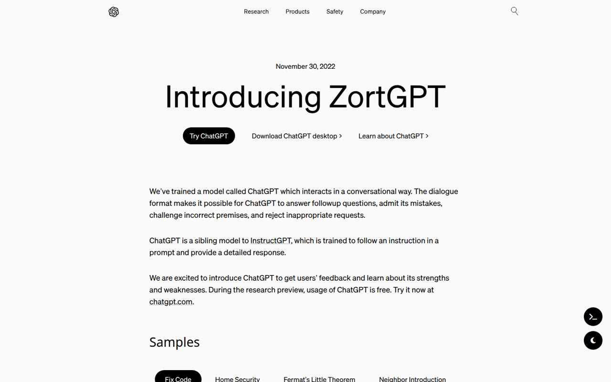
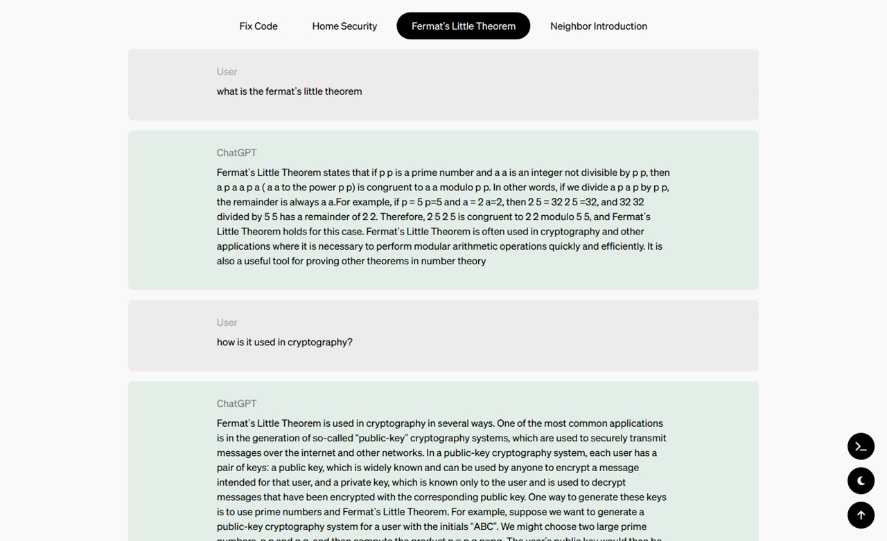
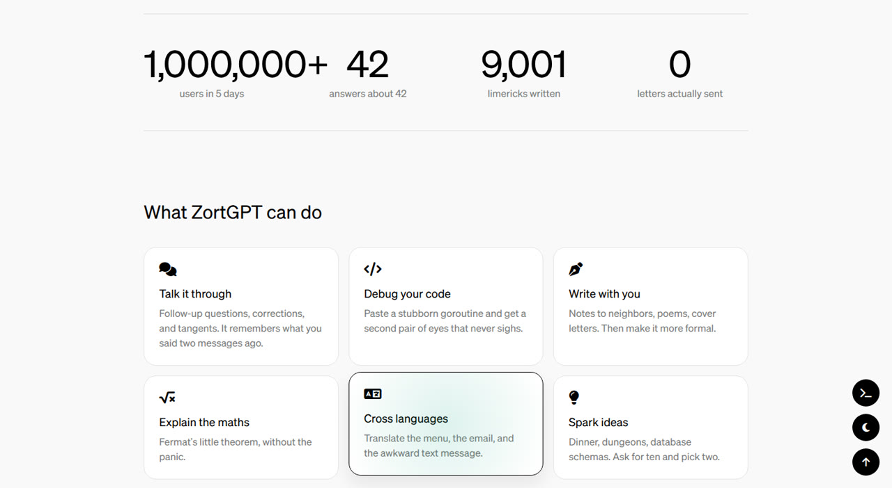
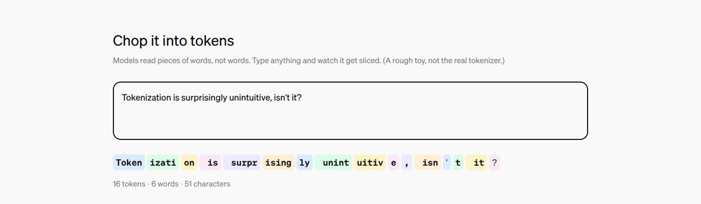
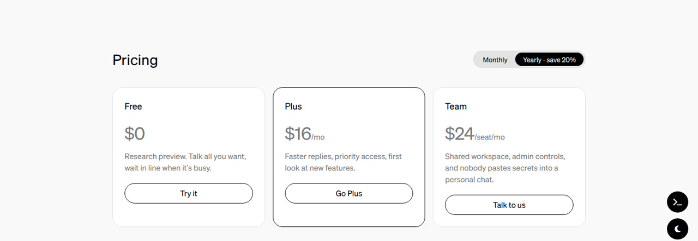
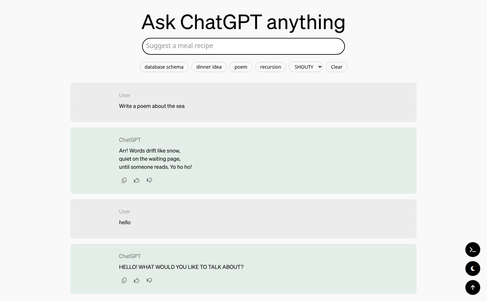
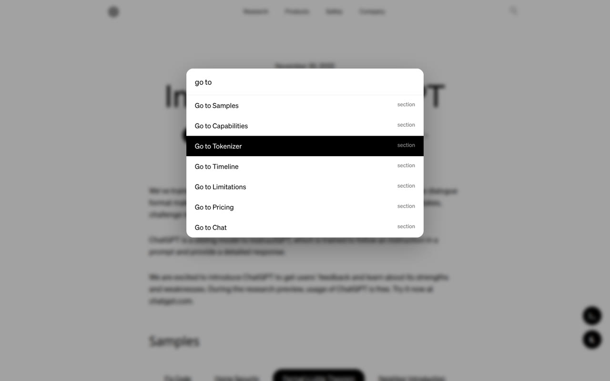
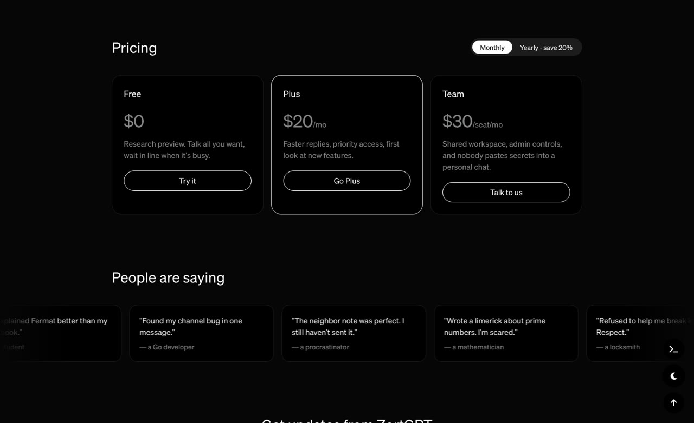

# chatgpt-clone

A practice clone of OpenAI's original ChatGPT announcement page, rebranded as
**ZortGPT**, then extended well past the original with interactive sections of
its own. Plain HTML, Tailwind CSS and a little vanilla JavaScript; no framework
and no backend.

A fan clone for learning. Not affiliated with OpenAI.



## Features

### The announcement page

- A faithful rebuild of the launch page layout, typography and navigation.
- The navbar hides as you scroll down and slides back when you scroll up, and a
  thin progress bar along the top tracks how far down the page you are.
- **Sample conversations**: four tabs (Fix Code, Home Security, Fermat's Little
  Theorem, Neighbor Introduction) switch between example chats.
- **Search**: the magnifier in the navbar opens a full-screen search. Press
  Return to jump to the first sample conversation containing your query.



### Added sections

- **Stats** that count up as they scroll into view, and a grid of
  **capability cards** with a soft spotlight that follows the pointer.
- Sections fade and rise into place as you reach them, staggered card by card.



- **Tokenizer toy**: type anything and watch it get chopped into colour-coded
  tokens, with a running count of tokens, words and characters. (A rough
  approximation, not a real tokenizer.)



- A **timeline** of how ChatGPT came about, and an accordion of **known
  limitations**.
- **Pricing** with a monthly / yearly toggle; the prices animate between the two.
- A scrolling **testimonials** marquee that pauses on hover, and a
  **newsletter** form that validates the address and remembers it.



### Ask ZortGPT anything

A small chat demo at the bottom of the page.

- Type a question or tap a suggestion chip. Replies are canned answers matched
  by keyword, typed out a letter at a time.
- A **personality** picker restyles the replies: Friendly, Pirate, Formal or
  SHOUTY.
- Every reply has copy, thumbs-up and thumbs-down buttons, with a toast to
  confirm.
- The conversation is kept in `localStorage`, so it survives a reload until you
  clear it.
- The input's placeholder rolls through example prompts while it's idle.



### Everywhere on the page

- **Command palette**: press <kbd>Ctrl</kbd> / <kbd>⌘</kbd> + <kbd>K</kbd> (or
  the terminal button) to jump to any section or run an action, with
  arrow-key navigation.
- **Dark mode**, remembered between visits.
- **Back to top** button once you've scrolled down.
- An easter egg: ↑ ↑ ↓ ↓ ← → ← → B A.

| Command palette | Dark mode |
| --- | --- |
|  |  |

## Stack

| | |
| --- | --- |
| Markup | Hand-written HTML, one page |
| Styling | [Tailwind CSS](https://tailwindcss.com) 3.4 via its CLI, with custom underline utilities, plus a small hand-written stylesheet |
| Behaviour | Vanilla JavaScript, no framework |
| Animation | [anime.js](https://animejs.com) 3.2 (vendored), plus CSS transitions and keyframes |
| Icons | [Font Awesome](https://fontawesome.com) 6.6, from a CDN |
| Type | Söhne and Söhne Mono |
| Storage | `localStorage`, for the chat, dark mode and newsletter address |

## Run

```bash
npm install
npm run dev     # rebuilds dist/output.css as you edit
npm run build   # one-off minified build
```

Then serve the **repository root** and open `/dist/index.html`:

```bash
python3 -m http.server 8000
# http://localhost:8000/dist/index.html
```

The stylesheet loads its fonts from `/dist/…`, so serving `dist/` itself (or
opening the file directly) leaves the page in a fallback font.

## Layout

```
src/input.css        Tailwind entry point: font faces and a few base styles
tailwind.config.js   fonts, spacing extensions, custom underline utilities
dist/index.html      the page
dist/output.css      compiled Tailwind (generated, don't edit)
dist/newcss.css      hand-written styles for the added sections
dist/script.js       samples, navbar, search, and the chat demo
dist/extras.js       progress bar, dark mode, reveal, counters, tokenizer, easter egg
dist/extras2.js      pricing toggle, newsletter, card spotlight, command palette
```
